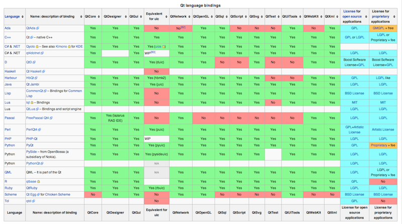

# Getting Started

This chapter will be about getting started with Qt. At the beginning, we will explain what is Qt, then move on to some background about Qt Project, then we talk about what you can do with Qt and what is Qt Quick, finally we will write a simple project with Qt Quick. At the end of this chapter you should understand why Qt is so cool :)

## About Qt

Qt (/ˈkjuːt/ "cute", or unofficially as Q-T cue-tee) is a cross-platform application framework that is widely used for developing application software with a graphical user interface (GUI) , and also used for developing non-GUI programs such as command-line tools and consoles for servers. 

### Who Use Qt?

Qt is most notably used in Autodesk Maya, The Foundry's Nuke, Adobe Photoshop Elements, Skype, VLC media player, VirtualBox, and Mathematica, and by the European Space Agency, DreamWorks, Google, HP, KDE, Lucasfilm, Panasonic, Philips, Samsung, Siemens, Volvo, Walt Disney Animation Studios and Research In Motion. The Opera web browser (up to version 10.0) also uses Qt, but only as an interface to the Linux platform.

### How Qt Works

Qt uses standard C++ but makes extensive use of a special code generator (called the Meta Object Compiler, or moc) together with several macros to enrich the language.

With the help of Qt you can write code once and deploy everywhere(almost, I will tell you later how many platforms does Qt support)

## A Short History of Qt

The Qt framework first became publicly available in May 1995. It was initially developed by Haavard Nord (Trolltech's CEO) and Eirik Chambe-Eng (Trolltech's president). Haavard and Eirik met at the Norwegian Institute of Technology in Trondheim, where they both graduated with master's degrees in computer science.

The toolkit was called Qt because the letter Q looked appealing in Haavard's Emacs font, and "t" was inspired by Xt, the X toolkit.

The first two versions of Qt had only two flavors: Qt/X11 for Unix and Qt/Windows for Windows. The Windows platform was only available under a proprietary license, which meant free/open source applications written in Qt for X11 could not be ported to Windows without purchasing the proprietary edition.

At the end of 2001, Trolltech released Qt 3.0, which added support for Mac OS X. The Mac OS X support was available only in the proprietary license until June 2003, when Trolltech released Qt 3.2 with Mac OS X support available under the GPL.

In June 2005, Trolltech released Qt 4.0.

Nokia acquired Trolltech ASA on 17 June 2008 and changed the name first to Qt Software, then to Qt Development Frameworks. Qt has been developing rapidly since then and became the offcial SDK for Symbian and Meego System. 

In March 2011, Nokia sold the commercial licensing part of Qt to Digia creating Qt Commercial.

On August 9, 2012, Digia acquired Qt software technologies from Nokia.

## What Can We Do With Qt

### Write Cross-Platform Applications

Qt spports varities of platforms, from pc to embedded devices, from windows to *nix. So you can develop once and deploy everywhere.

- Officially supported platforms
	- Windows
	- Mac
	- Linux/X11
	- Symbian
	- Meego
	- Maemo
	- Embedded Linux
	- QNX
	- VxWorks (Digia Qt support only available for commercial licensees)
- supported by Communities
	- [IOS](http://www.qt-iphone.com/Introduction.html)
	- [Android](http://necessitas.kde.org/)
	- [WebOS](http://www.webos-internals.org/wiki/HowtoQt)
	- [Blackberry](http://qt-project.org/wiki/Blackberry)
	- [RaspberryPi](http://qt-project.org/wiki/Qt-RaspberryPi) 
	
### Both OpenSource && Commerical

- License for Qt:
	- GPL
	- LGPL
	- Commerical
	
So, if you want to develop full opensource project such as linux kernel, you can ues the GPL liscense; if you want to develop commercial closed-source programs with Qt, you can use LGPL or Commerical License. This is very convenient.

You can get the source code of Qt [Here](http://qt.gitorious.org/qt/qt).

### Bindings for other languages

Don't know how to use C++ or you have your favourite one? No problem, Qt has a range of bindings for various languages that implement some or all of its feature set.

Here is a picture from [Wikipedia](http://en.wikipedia.org/wiki/Qt_\(framework\))

- Python
	- [PySide](http://qt-project.org/wiki/Category:LanguageBindings::PySide) (LGPL)
	
		The PySide project provides LGPL-licensed Python bindings for the Qt cross-platform application and UI framework, as well as a complete toolchain for rapidly generating bindings for any Qt-based C++ class hierarchies. PySide Qt bindings allow both free open source and proprietary software development and ultimately aim to support all of the platforms as Qt itself.
	
	- [PyQt](http://www.riverbankcomputing.com/news) (GPL/commercial)
	
		PyQt is a set of Python bindings for Nokia's Qt application framework and runs on all platforms supported by Qt including Windows, MacOS/X and Linux. There are two sets of bindings: PyQt v4 supports Qt v4; and the older PyQt v3 supports Qt v3 and earlier. The bindings are implemented as a set of Python modules and contain over 300 classes and over 6,000 functions and methods.
	
- Java
	- [Qt Jambi](http://qt-jambi.org/) (LGPL)
	
		Qt Jambi – Qt bindings to the Java programming language – has been discontinued in order to focus resources on the Qt cross platform application and UI framework. 
	
- Ruby
	- [QtRuby](http://techbase.kde.org/Development/Languages/Ruby) 
	
		The project provides complete bindings to both the KDE API and the Qt APIs. The Korundum package includes both a QtRuby Qt-only binding along with the full combined Qt/KDE one. The QtRuby package contains just Qt bindings with no dependencies on KDE.
	
- BASIC
	- [Basic for Qt](http://www.kbasic.com/)
	
		KBasic uses Qt as its toolkit to provide cross-platform abilities. KBasic is a further BASIC dialect and is related to VB.NET™, Visual Basic®, Visual Basic for Application® and Java™. It combines several features and includes built-in backward support for QBasic®.
	
- Ada 2005
	- [QtAda](http://www.qtada.com/)
	
		QtAda is an Ada2005 language bindings to the Qt libraries and a set of useful tools. Qt is a cross-platform C++ development framework developed and supported by Nokia. QtAda supports Qt version 4.6 and later.

		QtAda allows easly to create cross-platform powerful graphical user interface completely on Ada 2005. QtAda applications will work on most popular platforms — Microsoft Windows, Mac OS X, Linux/Unix — without any changes and platform specific code. QtAda applications use native look and feel (and even use user's Control Panel setting) on every supported platforms.

		QtAda allows to use all power of visual GUI development with Qt Designer on all software lifecycle stages — from prototyping and up to maintanace.
	
- Perl
	- [Qt for Perl](http://opendesktop.org/content/show.php/?action=content&content=69748)
	
		The goal of this project is to maintain a Perl Object Oriented interface to the Qt GUI Toolkit.
	
- C#
	- [Qyoto](http://techbase.kde.org/Development/Languages/Qyoto)
	
		Qyoto makes it possible to develop Qt and KDE applications using C#, or any other .NET language. Qyoto uses SMOKE, and offers access to almost all Qt and KDE classes.
	
- D
	- [QtD](http://www.dsource.org/projects/qtd)
	
		QtD is a binding of the Qt application and UI framework to the D programming language version 2.
	
- Pascal
	- [Free Pascal Qt4 Binding](http://users.telenet.be/Jan.Van.hijfte/qtforfpc/fpcqt4.html)
	
		The Free Pascal Qt4 binding allows Free Pascal to interface with the C++ Library Qt. This binding does not cover the whole Qt4 framework but only the classes needed by the Cross Platform Lazarus IDE to use Qt as a Widget set. 
	
- Lua
	- [QtLua](http://www.nongnu.org/libqtlua/)
	
		The QtLua library aims to make Qt4 applications scriptable using the Lua scripting language. It is an alternative to the QtScript module.

		QtLua does not generate or use generated binding code for Qt. Instead it provides useful C++ wrapper classes to make C++ and lua objects accessible from both lua and C++. It takes advantages of the Qt meta object system to expose QObject members to lua scripts.

		QtLua is not designed to develop an application in pure Lua but rather to extend a Qt C++ application using Lua as scripting language.
	
- Haskell
	- [qtHaskell](http://qthaskell.berlios.de/)
	
		The qtHaskell project provides a set of Haskell bindings for Qt. Haskell programmers can access the “Signals and Slots” interface logic, design interfaces using Qt Designer and write scripted applications using the Qt ECMA/Javascript engine.
	
	- [HsQML](http://www.gekkou.co.uk/software/hsqml/)
	
		HsQML provides a Haskell binding to the Qt Quick framework. It allows you to write graphical applications where the front-end is written in Qt Quick’s QML language (incorporating JavaScript) and the back-end is written in Haskell.
	
- PHP
	- [PHP-Qt](https://developer.berlios.de/projects/php-qt/)
	
		PHP-Qt is an extension for PHP5 that aims to write software with the Qt Toolkit. It provides an object-oriented interface to the Qt4 Framework and allowes to write Qt applications in the PHP language.
		
- Scheme
	- [Qt for Chicken Scheme](http://wiki.call-cc.org/eggref/4/qt)
	
		This extension provides an easy to use interface to Trolltech's Qt 4 toolkit. It provides bindings for the GUI side of Qt, as well as for Qt's builtin networking and dbus libraries. 
	
## About Qt Quick

### Introduction to Qt Quick

Today’s consumers and enterprise users are tough to please. They grew up using slick UIs on their game consoles and seeing even fancier UIs at the movies. Specifications and feature lists alone are no longer selling points; they are means to an end. Visual impact and experience WOW are the selling points that matter today, and the consumer expects this visual delight whether they are using a powerful corporate notebook computer, a mobile device, a sleek tablet, or a set-top box.

Delivering this experience requires designers and developers to work together like never before. Gone are the days where designers could throw pixel maps over the wall and expect developers to implement their vision. So too are the days when developers could code purely for performance without regard to visual appeal. Design/development/test must become an iterative cycle, not a linear path. The Qt framework is known for high runtime performance and small footprint, making it ideal for mobile, embedded, and netbook applications. The Qt 4.7 release extends Qt with QML, a declarative language that codes the way designers think, and Qt Quick elements that are the building blocks for applications, Each frame of a story board is declared as a branch in an element tree; each visual aspect of a frame is declared as a property of elements on the branch; each transition between frames can be decorated with a variety of animations and effects.

The Qt Quick runtime implements the UI and provides direct access to native APIs and performance boosts with C++ extensions where appropriate. And because the runtime is implemented in Qt, it delivers cross-platform reach and flexibility.

Qt Creator, a development environment built for collaboration between designers and developers, supports Qt Quick. Designers work in a visual environment, developers work in a full-featured IDE, and Qt Creator supports round-trip iteration from design, to code, to test, and back to design.

Qt is built for the way product teams work today. Core business logic is coded by developers and optimized for performance, the interface is crafted by designers working with visual tools, and integrated tooling supports round-trip iteration between the disciplines.

### Overview

Qt’s new user interface technology consists of the QML language, Elements that provide basic building blocks of the language, the QtDeclarative (C++) module that provides a runtime for the QML language, and a scripting language based on JavaScript that allows developers to implement logic in their projects with no C++ coding required. This technology set is supported by the Qt Creator tool that now includes a visual designer and other extensions to support creating, testing, debugging, and optimizing projects.

QML provides mechanisms to declaratively build an object tree using elements. QML improves the integration between JavaScript and Qt’s existing QObject based type system, adds support for automatic property bindings and provides network transparency at the language level.
Elements are a sophisticated set of graphical and behavioral building blocks. There are currently over 80 elements in the language, including visual elements such Rectangle, Gradient, and AnimatedImage; interaction elements including MouseArea and Flickable; state elements including PropertyChanges and StateChangeScript; and transition elements including Transition and SequentialAnimation. There are also elements to handle data, views, position, and other sophisticated aspects of building fluid UIs without C++ code.

Elements are combined together in QML documents to build components ranging in complexity from simple buttons and sliders, to complete internet-enabled applications like a Flickr photo browser. Developers and designers are free to build their own or choose from libraries of pre-built components.

Qt Quick builds on Qt’s existing strengths. QML can be used to incrementally extend an existing application or to build completely new applications. QML is fully extensible from C++.

## A Simple Example With Qt Qucik

## Something Interesting

